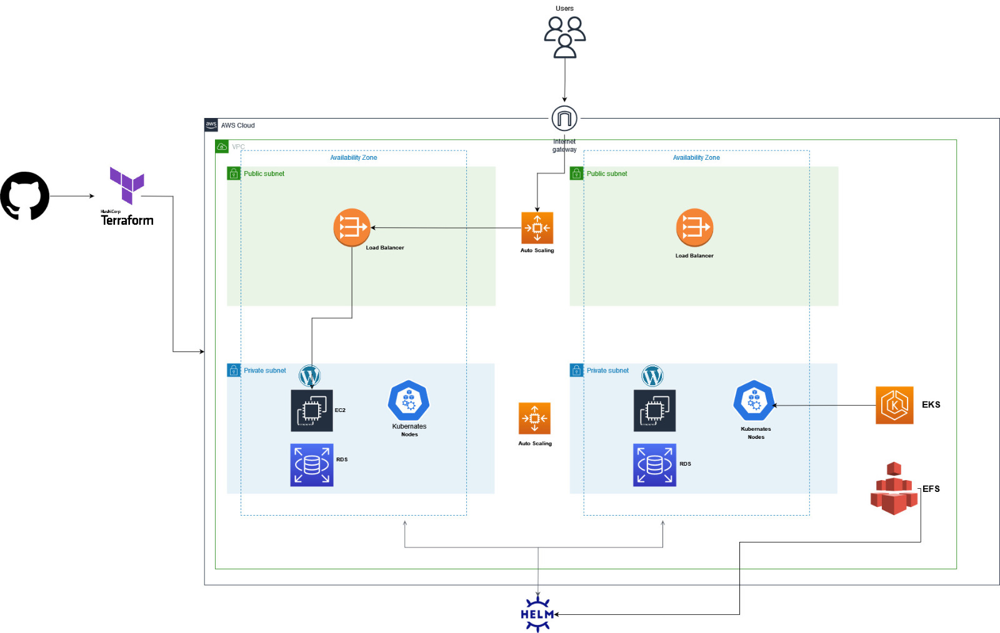

# Multi-Tier Application Deployment in EKS

## Prerequisites:
- Terraform installation on your pc
- Kubectl and Minikube installation
- Installing Helm locally on your pc

- Lucid for the architectural diagram

## Architectural Diagram



## Summary:

Deploying a multi-tier application (WordPress), using EKS (Elastic Kubernetes Service), EFS (Elastic File System), RDS (Relational Database Service) using Terraform and Helm.

1. To deploy a web app using EKS, you set up EKS Cluster.

2. To make the WordPress data and configuration persistent, you need persistent storage. (EFS for this step)

3. WordPress docker image to simulate the WordPress application

4. Relational Database for WordPress.

## Terraform Files and Setup

### Creating EKS Cluster and EFS Storage:

 - The [eks.tf](https://github.com/elsie-dev/7Ts/blob/main/terraform/02_eks.tf) uses EKS terraform module to define the EKS cluster by specifying configurations like region, and instance type.
 - You can also view the [vpc.tf](https://github.com/elsie-dev/7Ts/blob/main/terraform/01_vpc.tf) file which has vpc module that contains the appropriate networking settings, like VPC, subnets, security group, and role.

### Defining EFS File System

- The [efs. tf](https://github.com/elsie-dev/7Ts/blob/main/terraform/03_efs.tf) is used to store the data and configuration for the project permanently.

**EFS provisioner** uses EFS Storage for creating resources in the EKS cluster.

I set up the efs provisioner using Helm and the file contents are located in the efs-provisioner folder.

**Command to setup Helm:**
```
helm init
```
```
helm create efs-provisioner
helm package efs-provisioner
helm install efs-provisioner efs-provisioner-0.1.0.tgz
```

Replace the cluster name with your cluster name created by Terraform.

Since the EKS Cluster will be created in the AWS console, and Helm is installed directly on your PC, for the two to communicate using Kubernetes you need to set up kubeconfig from your terminal

```
aws eks update-kubeconfig --name <cluster-name> --region <region>
kubectl get pods --all-namespaces
helm package .
helm install efs ./efs-provisioner-0.1.0.tgz --kubeconfig ~/pathtoconfigfile
```

The command above is used to install Helm Chart called efs using a specific Kubernetes configuration file.

Here's an example of the expected output screenshot:


To use EFS Provisioner in Kubernetes Deployment to dynamically provision EFS Volume, you need a **PersisstantVolumeClaim (PVC).**

### Provisioning the RDS Database

The RDS database instance is used by WordPress.

**Running terraform scripts:**

- Clone the repo
- Cd to the terraform folder
- Run ```terraform init```, this command initializes the backend which is responsible for storing Terraform state.
- Tfvar allows to separate  sensitive values for my case, the environment tag from the main code. Not including it in the Terraform  plan and apply the command generates an error

 ```
  terraform plan --var-file=tfvars/dev.tfvars &&  terraform apply --var-file=tfvars/dev.tfvars
 ```

## Setting up Helm for WordPress Deployment

# Deployng Wordpress to EKS
- Add helm repo to the environment
helm repo add my-repo https://charts.bitnami.com/bitnami

- Installing helm chart for wordpress
helm install my-release my-repo/wordpress --set wordpressPassword=password

- After deployment check pods
kubectl get pods

- After successful deployment,check the pods and see the status using;
kubectl get pods

To access the external WordPress site:

```
export SERVICE_IP=$(kubectl get svc --namespace default wp-demo-wordpress --include "{{ range (index .status.loadBalancer.ingress 0) }}{{ . }}{{ end }}")
echo "WordPress URL: http://$SERVICE_IP/"
echo "WordPress Admin URL: http://$SERVICE_IP/admin"
```

## Clean Up Steps

- To destroy the nodes

```
kubectl delete nodes --all
```
- To delete the storage class created earlier use:

```
kubectl delete -f efs-storageclass.yaml
```
- To delete the terraform files

```
terraform destroy --var-file=tfvars/dev.tfvars
```

## Challenges Faced:

1.  **Error:** While running ```terraform plan``` command, kept getting
    undeclared input variables for the eks.tf file

    **Solution:** Creating tfvar folder with env variables defined and
    referencing them while running terraform scripts ```terraform
    plan --var-file=tfvars/devtfvars```

2.  **Error:** Kubectl get nodes command failed. This resulted from the DNS
    resolution issue in the network when the API endpoint is not
    accessible

    **Solution:** Destroying the previous resources provisioned by Terraform.
    Recreating them, ensuring the DNS server in the network resolves to the correct
    hostname

3.   **Error**: Connection to server localhost:8080 was refused did you specify port?

     

     **Solution**: This occurs when Kubectl has no permission to
     access the cluster. Once eks has been provisioned by Terraform, you need to set the
     kubeconfig to communicate to the cluster.

     The command used is:

    ```
     aws eks --region REGION update-kubeconfig --name CLUSTER_NAME
      kubectl config view
      kubectl get node
   ```
4.  **Error**: After while deploying wordpress after installing Helm, pods being in pending state
       

    **Solution**: dependency issue with the persistant volume and storage class. (Work In progress)

5.   **Error**: Trying to Access the deployed Wordpres site: Page not working

       

     **Solution**: Allowing port 80 on the load balancer (WIP)

## References Used:

* [Deploying application Using Helm in Kuberenetes](https://medium.com/avmconsulting-blog/deploying-applications-using-helm-in-kubernetes-b5c8b609e4b5)
* [Creating AWS VPC for EKS Cluster](https://www.youtube.com/watch?v=nIIxexG7_a8&list=PLiMWaCMwGJXkeBzos8QuUxiYT6j8JYGE5)

* [Pods in pending state](https://sysdig.com/blog/kubernetes-pod-pending-problems/)